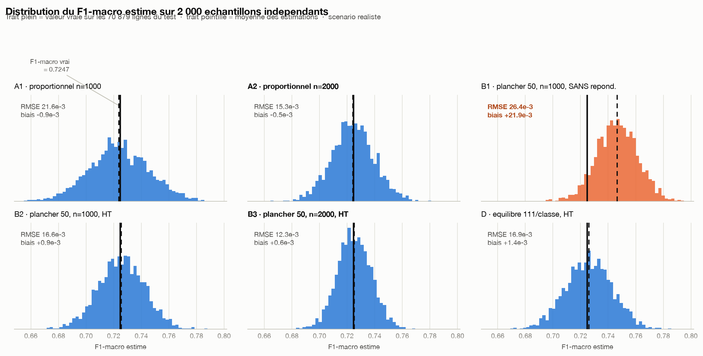
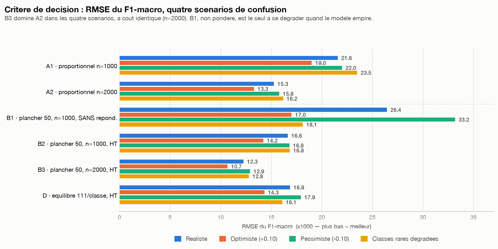
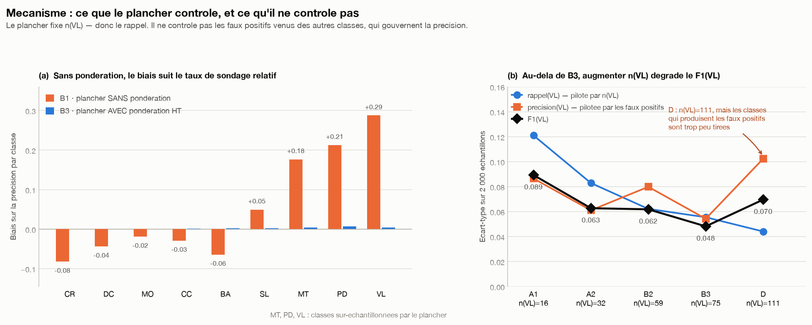

# H.1 — Composition de l'échantillon d'évaluation LLM

**Simulation Monte-Carlo — arbitrage sur le RMSE**
Scripts : `tools/h1_simulation.py`, `tools/h1_apparie.py`, `tools/h1_decomposition.py`
Sorties brutes : `scratch/h1_resultats.csv`, `h1_apparie.csv`, `h1_decomposition.csv` (non versionnées, régénérables)
2 000 réplicats par stratégie · seed 42 · date 2026-08-11

---

## Verdict

> **B3 — plancher 50 par classe, n = 2 000, avec repondération Horvitz-Thompson obligatoire.**
>
> B3 domine A2 dans **les quatre scénarios**, à coût LLM identique : RMSE du F1-macro
> **12,3·10⁻³ contre 15,3·10⁻³** (−20 %), RMSE du F1 de la classe la plus faible
> **0,048 contre 0,063** (−23 %). Pour égaler B3, A2 devrait passer à **n ≈ 3 100**,
> soit 55 % d'appels LLM en plus.
>
> Ta règle de décision annoncée à l'avance — « si B3 est nettement meilleur, on prend B3
> avec HT obligatoire » — se déclenche. Le gain est modeste en valeur absolue mais il est
> **systématique** : B3 n'est jamais battu par A2, sur aucun scénario, sur aucune des trois
> quantités mesurées.

Deux réserves qui conditionnent l'application, détaillées en §7 : la repondération devient
une **dépendance critique** (sans elle, B1 montre un biais de +21,9·10⁻³ sur le F1-macro et
de **+0,29 sur la précision de `Vehicle loan or lease`**), et le gain reste inférieur au
plancher d'incertitude qui pèsera de toute façon sur la comparaison LLM vs ML (§6).

---

## 1. Construction de la matrice de confusion

**C'est une hypothèse de travail explicite, pas une mesure.** Aucune donnée réelle de
prédiction n'existe à ce stade. La matrice est construite en deux temps.

### 1.1 Diagonale (= rappel par classe)

Quatre valeurs sont imposées par ton cahier des charges (`Mortgage` 0,88, `Student loan`
0,85, `Debt collection` 0,65, `Payday` 0,55). Les cinq autres sont calées à la main en
suivant la **signature lexicale propre** mesurée en C.3 du diagnostic (diagonale du tableau
de recouvrement) : plus la signature est forte, plus le rappel est élevé.

| Classe | Signature propre (C.3) | Rappel retenu | Origine |
|---|---:|---:|---|
| Mortgage | 80,4 % | 0,88 | imposé |
| Student loan | 73,3 % | 0,85 | imposé |
| Credit reporting | 62,7 % | 0,90 | calé — classe attracteur, très gros effectif |
| Vehicle loan or lease | 55,1 % | 0,60 | calé — signature correcte mais forte fuite vers CR |
| Credit card or prepaid card | 51,6 % | 0,72 | calé |
| Money transfer or virtual currency | 43,0 % | 0,68 | calé |
| Bank account or service | 42,9 % | 0,70 | calé |
| Debt collection | 27,8 % | 0,65 | imposé |
| Payday, title or personal loan | 24,3 % | 0,55 | imposé |

### 1.2 Hors-diagonale (= structure des fuites)

Le budget d'erreur `E_i = 1 − M_ii` est réparti sur les autres classes **proportionnellement
au tableau de recouvrement lexical de C.3**. Cette partie n'est donc **pas choisie à la
main** : elle découle des mesures du diagnostic.

Elle produit mécaniquement les deux propriétés que tu demandais :

- la fuite dominante va vers `Credit reporting` pour CR/DC/MO/CC/SL/PD/VL — c'est la
  colonne la plus forte de C.3 pour ces sept classes ;
- la fuite `Vehicle loan → Credit reporting` est la plus élevée de sa ligne : **28,0 %**,
  soit 70 % du budget d'erreur de VL (cohérent avec les 26,7 % mesurés en C.3).

**Deux exceptions que je signale plutôt que de les forcer** : pour `Bank account` et
`Money transfer`, la fuite dominante n'est **pas** `Credit reporting` mais respectivement
`Credit card` (12,0 %) et `Bank account` (14,1 %). C'est ce que disent les données de C.3
(colonnes 9,2 et 9,1 contre 3,5 et 0,7 pour credit report), et c'est cohérent avec les
paires confondables identifiées en F.9 du diagnostic. Forcer ces deux lignes vers CR aurait
été une entorse aux mesures pour faire coller la simulation à l'énoncé.

### 1.3 Matrice retenue — scénario réaliste (%, lignes = classe vraie)

| | CR | DC | MO | CC | BA | SL | MT | PD | VL |
|---|---:|---:|---:|---:|---:|---:|---:|---:|---:|
| **CR** | **90,0** | 1,8 | 2,0 | 3,1 | 0,3 | 1,2 | 0,0 | 0,2 | 1,4 |
| **DC** | 23,5 | **65,0** | 2,1 | 4,5 | 0,9 | 1,3 | 0,2 | 1,0 | 1,4 |
| **MO** | 5,7 | 1,4 | **88,0** | 1,2 | 1,5 | 1,3 | 0,3 | 0,1 | 0,5 |
| **CC** | 16,4 | 2,0 | 1,7 | **72,0** | 4,5 | 0,3 | 1,8 | 0,2 | 1,0 |
| **BA** | 4,6 | 1,2 | 4,7 | 12,0 | **70,0** | 0,6 | 4,0 | 0,9 | 2,0 |
| **SL** | 7,4 | 2,7 | 1,4 | 1,3 | 1,4 | **85,0** | 0,0 | 0,3 | 0,5 |
| **MT** | 1,1 | 0,9 | 2,5 | 11,2 | 14,1 | 0,6 | **68,0** | 0,2 | 1,4 |
| **PD** | 13,6 | 5,8 | 2,4 | 4,6 | 10,7 | 1,0 | 1,1 | **55,0** | 5,7 |
| **VL** | 28,0 | 2,9 | 1,8 | 2,5 | 3,4 | 0,4 | 0,2 | 0,7 | **60,0** |

### 1.4 Cible à estimer

Application de M aux 70 879 lignes du test (distribution F.7) :

| | CR | DC | MO | CC | BA | SL | MT | PD | VL |
|---|---:|---:|---:|---:|---:|---:|---:|---:|---:|
| rappel | 0,900 | 0,650 | 0,880 | 0,720 | 0,700 | 0,850 | 0,680 | 0,550 | 0,600 |
| précision | 0,735 | 0,915 | 0,876 | 0,704 | 0,769 | 0,842 | 0,672 | 0,674 | **0,434** |
| F1 | 0,809 | 0,760 | 0,878 | 0,712 | 0,733 | 0,846 | 0,676 | 0,606 | **0,504** |

**F1-macro vrai = 0,72471.** C'est la valeur que chaque stratégie doit estimer.

Note de lecture intéressante en soi : la précision de `Vehicle loan or lease` s'effondre à
0,434 alors que son rappel est de 0,600. Ce n'est pas un artefact — c'est la conséquence
directe du fait que 1,4 % des 21 550 `Credit reporting` prédits VL (soit ~300 items) suffit
à noyer les 685 vrais positifs d'une classe qui ne pèse que 1 141 lignes. **Le déséquilibre
frappe la précision des classes rares, pas leur rappel.**

### 1.5 Trois variantes de robustesse

| Scénario | Diagonale |
|---|---|
| **réaliste** | valeurs du §1.1 |
| **optimiste** | +0,10 sur toute la diagonale (plafonné à 0,97) |
| **pessimiste** | −0,10 sur toute la diagonale |
| **classes rares dégradées** | MT 0,40 · PD 0,35 · VL 0,35, les six autres inchangées |

---

## 2. Les six stratégies

Allocation par classe (nombre d'items tirés) :

| | CR | DC | MO | CC | BA | SL | MT | PD | VL | Total | Repondération |
|---|---:|---:|---:|---:|---:|---:|---:|---:|---:|---:|---|
| **A1** | 304 | 237 | 149 | 117 | 78 | 62 | 20 | 17 | **16** | 1 000 | — |
| **A2** | 608 | 474 | 299 | 234 | 156 | 123 | 39 | 35 | **32** | 2 000 | — |
| **B1** | 217 | 180 | 132 | 114 | 93 | 84 | 61 | 60 | **59** | 1 000 | **non** |
| **B2** | 217 | 180 | 132 | 114 | 93 | 84 | 61 | 60 | **59** | 1 000 | HT |
| **B3** | 521 | 418 | 282 | 231 | 171 | 145 | 80 | 77 | **75** | 2 000 | HT |
| **D** | 111 | 111 | 111 | 111 | 111 | 111 | 111 | 111 | **111** | 999 | HT |

Taux de sondage `f_i = n_i / N_i` (×1000) — c'est la grandeur qui gouverne tout :

| | CR | DC | MO | CC | BA | SL | MT | PD | VL |
|---|---:|---:|---:|---:|---:|---:|---:|---:|---:|
| A1 / A2 | 14,1 / 28,2 | 14,1 / 28,2 | 14,1 / 28,3 | 14,1 / 28,3 | 14,1 / 28,2 | 14,2 / 28,3 | 14,4 / 28,0 | 13,8 / 28,5 | 14,0 / 28,1 |
| B1 / B2 | 10,1 | 10,7 | 12,5 | 13,8 | 16,8 | 19,3 | 43,8 | 48,8 | **51,7** |
| B3 | 24,2 | 24,9 | 26,6 | 27,9 | 30,9 | 33,3 | 57,4 | 62,7 | **65,7** |
| D | 5,2 | 6,6 | 10,5 | 13,4 | 20,0 | 25,5 | 79,7 | 90,3 | **97,3** |

En proportionnel les taux sont uniformes ; c'est exactement ce qui rend la re-pondération
inutile pour A1/A2 (les poids `N_i/n_i` sont tous égaux et se simplifient).

**Détail d'implémentation** : un tirage stratifié sans remise dans une strate dont les
items portent des étiquettes prédites en proportions connues suit exactement une
**hypergéométrique multivariée**. On tire donc directement les lignes de la matrice de
confusion échantillonnée plutôt que de matérialiser les individus — c'est exact, pas une
approximation, et environ 1 000× plus rapide.

---

## 3. Résultats — scénario réaliste



### 3.1 F1-macro (valeur vraie 0,72471)

| Strat | n(VL) | moyenne | biais | écart-type | **RMSE** | IC 95 % empirique |
|---|---:|---:|---:|---:|---:|---|
| A1 | 16 | 0,7238 | −0,0009 | 0,0216 | **0,0216** | [0,6819 ; 0,7664] |
| A2 | 32 | 0,7243 | −0,0005 | 0,0153 | **0,0153** | [0,6944 ; 0,7549] |
| B1 | 59 | 0,7466 | **+0,0219** | 0,0149 | **0,0264** | [0,7178 ; 0,7758] |
| B2 | 59 | 0,7256 | +0,0009 | 0,0166 | **0,0166** | [0,6925 ; 0,7579] |
| **B3** | 75 | 0,7253 | +0,0006 | 0,0123 | **0,0123** | [0,7017 ; 0,7497] |
| D | 111 | 0,7261 | +0,0014 | 0,0168 | **0,0169** | [0,6930 ; 0,7581] |

Trois lectures immédiates :

1. **B1 est disqualifié.** Son écart-type est excellent (0,0149, meilleur que A2) mais son
   biais de +0,0219 le rend moins bon que A2 en RMSE. Un plancher sans repondération
   **surestime systématiquement le F1-macro de 2,2 points**. C'est exactement le mécanisme
   que tu décrivais.
2. **La repondération HT corrige le biais quasi intégralement** : B2 passe de +0,0219 à
   +0,0009, soit un biais résiduel 24× plus petit et négligeable devant l'écart-type.
3. **D est décevant.** À n≈1000, l'échantillon équilibré ne fait pas mieux que B2
   (0,0169 contre 0,0166) alors qu'il tire 111 VL contre 59. Le §5 explique pourquoi.

### 3.2 F1 de `Vehicle loan or lease` (valeur vraie 0,5035)

| Strat | n(VL) | moyenne | biais | écart-type | **RMSE** | IC 95 % |
|---|---:|---:|---:|---:|---:|---|
| A1 | 16 | 0,5048 | +0,0013 | 0,0893 | **0,0893** | [0,333 ; 0,667] |
| A2 | 32 | 0,5040 | +0,0005 | 0,0627 | **0,0627** | [0,377 ; 0,627] |
| B1 | 59 | 0,6514 | **+0,1479** | 0,0507 | **0,1563** | [0,547 ; 0,743] |
| B2 | 59 | 0,5058 | +0,0023 | 0,0618 | **0,0618** | [0,390 ; 0,630] |
| **B3** | 75 | 0,5050 | +0,0016 | 0,0482 | **0,0482** | [0,413 ; 0,604] |
| D | 111 | 0,5109 | +0,0074 | 0,0696 | **0,0700** | [0,386 ; 0,654] |

C'est ici que tout se joue. **Le biais de B1 atteint +0,148** : un F1 vrai de 0,50 serait
rapporté à 0,65. C'est une erreur de conclusion, pas une imprécision.

Et A1 — la stratification proportionnelle à n=1000, c'est-à-dire la spécification
d'origine — donne un IC 95 % de **[0,333 ; 0,667]**. Une amplitude de 33 points de F1 sur
une classe. Ma mise en garde de la section F.7 du diagnostic (« intervalle de l'ordre de
±0,15 ») était correcte : c'est ±0,17 en pratique.

### 3.3 Précision de `Credit reporting` (valeur vraie 0,7347)

| Strat | moyenne | biais | écart-type | **RMSE** |
|---|---:|---:|---:|---:|
| A1 | 0,7346 | −0,0001 | 0,0178 | **0,0178** |
| A2 | 0,7348 | +0,0001 | 0,0126 | **0,0126** |
| B1 | 0,6526 | **−0,0821** | 0,0205 | **0,0846** |
| B2 | 0,7360 | +0,0013 | 0,0190 | **0,0190** |
| **B3** | 0,7351 | +0,0003 | 0,0126 | **0,0126** |
| D | 0,7350 | +0,0003 | 0,0223 | **0,0223** |

B1 dégrade la précision de CR de 8,2 points. Ta prédiction de signe est exacte (§5.2).

---

## 4. Robustesse — RMSE du F1-macro sur les quatre scénarios



RMSE ×1000 (plus bas = meilleur) :

| Strat | réaliste | optimiste | pessimiste | rares dégradées |
|---|---:|---:|---:|---:|
| A1 | 21,58 | 19,01 | 22,00 | 23,49 |
| **A2** | **15,27** | **13,31** | **15,80** | **16,18** |
| B1 | 26,44 | 17,02 | 33,17 | 18,13 |
| B2 | 16,65 | 14,23 | 16,81 | 16,83 |
| **B3** | **12,26** | **10,68** | **12,91** | **12,79** |
| D | 16,86 | 14,33 | 17,94 | 16,10 |

Biais ×1000 :

| Strat | réaliste | optimiste | pessimiste | rares dégradées |
|---|---:|---:|---:|---:|
| A1 | −0,87 | −0,37 | −0,47 | −1,49 |
| A2 | −0,46 | −0,06 | +0,15 | −0,58 |
| B1 | **+21,86** | **+11,55** | **+28,94** | **+6,56** |
| B2 | +0,89 | +0,25 | +0,81 | +0,99 |
| B3 | +0,56 | +0,60 | +0,37 | −0,10 |
| D | +1,38 | +0,69 | +1,86 | +1,17 |

**B3 est meilleur que A2 dans les quatre scénarios**, avec un gain remarquablement stable
(−20 %, −20 %, −18 %, −21 %). Aucune configuration testée n'inverse le classement.

Point notable : **le biais de B1 dépend du scénario** (+6,6 à +28,9·10⁻³) et il est
d'autant plus fort que le modèle est mauvais. Un estimateur dont le biais grandit quand la
performance baisse est particulièrement dangereux dans un projet de comparaison — il
flatterait le plus faible des deux modèles.

---

## 5. Vérification de tes deux affirmations



### 5.1 (a) Le rappel est-il invariant au taux de sondage ? — **CONFIRMÉ**

Rappel moyen estimé par classe, toutes stratégies confondues :

| | CR | DC | MO | CC | BA | SL | MT | PD | VL |
|---|---:|---:|---:|---:|---:|---:|---:|---:|---:|
| A1 | 0,8991 | 0,6506 | 0,8792 | 0,7199 | 0,6991 | 0,8500 | 0,6766 | 0,5496 | 0,6034 |
| A2 | 0,8996 | 0,6499 | 0,8800 | 0,7192 | 0,7013 | 0,8502 | 0,6778 | 0,5508 | 0,5995 |
| B1/B2 | 0,9006 | 0,6512 | 0,8805 | 0,7202 | 0,6994 | 0,8511 | 0,6783 | 0,5524 | 0,5970 |
| B3 | 0,8999 | 0,6506 | 0,8805 | 0,7204 | 0,7007 | 0,8511 | 0,6803 | 0,5500 | 0,6011 |
| D | 0,9001 | 0,6484 | 0,8794 | 0,7217 | 0,7009 | 0,8500 | 0,6811 | 0,5504 | 0,6006 |
| **VRAI** | **0,9000** | **0,6500** | **0,8800** | **0,7200** | **0,7001** | **0,8500** | **0,6798** | **0,5500** | **0,6004** |

Écart maximal à la valeur vraie : **A1 0,0032 · A2 0,0020 · B1/B2 0,0034 · B3 0,0011 ·
D 0,0018**. Tous de l'ordre de l'erreur Monte-Carlo (2 000 réplicats), sans tendance liée au
taux de sondage. Ton `Rappel_c = M_cc`, invariant en `n_i`, est vérifié : le rappel estimé
est une proportion binomiale à l'intérieur de la strate `c`, donc sans biais quel que soit
`n_c` — seule sa **variance** dépend de `n_c`.

### 5.2 (b) Le biais sur la précision de B1 a-t-il le signe annoncé ? — **CONFIRMÉ, avec une nuance**

Biais sur la précision par classe, B1 (non pondéré) :

| | CR | DC | MO | CC | BA | SL | MT | PD | VL |
|---|---:|---:|---:|---:|---:|---:|---:|---:|---:|
| **biais B1** | **−0,082** | −0,044 | −0,019 | −0,029 | −0,064 | **+0,050** | +0,177 | +0,213 | **+0,288** |
| f_i / f̄ (B1) | 0,40 | 0,42 | 0,49 | 0,54 | 0,66 | 0,76 | 1,73 | 1,93 | 2,05 |
| biais B3 (HT) | +0,000 | +0,000 | +0,000 | +0,001 | +0,002 | +0,002 | +0,004 | +0,007 | +0,005 |

**Ta prédiction est exacte sur les deux points que tu nommais** : la précision des classes
rares est gonflée (`VL` +0,288, `PD` +0,213, `MT` +0,177) et celle de `Credit reporting` est
dégradée (−0,082). La repondération HT ramène tous ces biais sous 0,007.

**La nuance** : la règle générale n'est pas « f_i au-dessus de la moyenne ⇒ précision
gonflée ». `Student loan` a un taux de sondage relatif de 0,76 (**sous** la moyenne) mais un
biais **positif** de +0,050. Ce n'est pas une anomalie, c'est la formule : le dénominateur
de `Précision_c` est `Σ_i n_i·M_ic`, donc le signe du biais dépend de `f_c` comparé à la
**moyenne des taux de sondage des classes qui fuient vers c, pondérée par ces fuites** — pas
à la moyenne globale. Les faux positifs de `Student loan` viennent surtout de `CR` (3,6) et
`DC` (2,0), les deux classes les **plus** sous-échantillonnées par le plancher (f/f̄ = 0,40
et 0,42) : son dénominateur rétrécit plus vite que son numérateur, d'où le biais positif
malgré un `f_SL` inférieur à la moyenne.

Formulation corrigée :

> **biais(Précision_c) > 0 ⟺ f_c > Σ_i (n_i·M_ic·f_i) / Σ_i (n_i·M_ic)**

Ta formulation reste juste pour les classes que tu citais, et le diagnostic opérationnel est
inchangé — mais le mécanisme est un peu plus fin qu'une simple comparaison à la moyenne.

---

## 6. Question 6 — le nombre d'items prédits `Vehicle loan or lease`

| Strat | n(VL) tirés | prédits VL (moy.) | IC 95 % | dont TP | dont **FP** | % réplicats à 0 |
|---|---:|---:|---|---:|---:|---:|
| A1 | 16 | 22,3 | [14 ; 30] | 9,7 | **12,6** | 0 % |
| A2 | 32 | 44,2 | [34 ; 55] | 19,2 | **25,0** | 0 % |
| B1/B2 | 59 | 49,0 | [39 ; 60] | 35,2 | **13,8** | 0 % |
| B3 | 75 | 71,6 | [59 ; 84] | 45,1 | **26,5** | 0 % |
| D | 111 | 81,9 | [70 ; 94] | 66,7 | **15,2** | 0 % |

**Ton hypothèse est partiellement confirmée — et la partie confirmée est la plus
importante.**

**Ce qui est infirmé** : le plancher *fait* bouger le dénominateur. De 44,2 (A2) à 71,6
(B3), soit +62 %. Il n'est donc pas exact que « le plancher ne le contrôle pas ».

**Ce qui est confirmé, et c'est le point décisif** : le plancher n'agit que sur la
composante **TP** (19,2 → 45,1). La composante **FP reste hors de contrôle** — 25,0 en A2
contre 26,5 en B3, quasiment inchangée. Or les FP proviennent des classes majoritaires, que
le plancher **sous-échantillonne**. Sous repondération HT, ces FP sont multipliés par des
poids d'autant plus grands que leur classe d'origine est peu tirée — ce qui **injecte de la
variance** dans l'estimateur de précision.

La décomposition rend le mécanisme visible (panneau (b) de la figure) :

| Strat | n(VL) | sd rappel(VL) | sd précision(VL) | **sd F1(VL)** | TP | FP |
|---|---:|---:|---:|---:|---:|---:|
| A1 | 16 | 0,1210 | 0,0865 | **0,0893** | 9,7 | 12,6 |
| A2 | 32 | 0,0829 | 0,0611 | **0,0627** | 19,2 | 25,0 |
| B2 | 59 | 0,0622 | 0,0799 | **0,0618** | 35,2 | 13,8 |
| **B3** | 75 | 0,0555 | **0,0543** | **0,0482** | 45,1 | 26,5 |
| D | 111 | **0,0441** | **0,1023** | **0,0700** | 66,7 | 15,2 |

C'est le résultat le plus intéressant de la simulation. **`D` a le meilleur écart-type de
rappel de toutes les stratégies (0,0441) et le pire écart-type de précision (0,1023).** En
poussant le plancher jusqu'à l'équilibre parfait, on tire si peu de `Credit reporting`
(111 sur 21 550, f = 5,2‰) que les faux positifs qu'il déverse dans VL deviennent un
comptage bruité, amplifié par un poids de 194. Le F1 de VL en ressort **plus mauvais qu'avec
B3 qui tire pourtant 36 % moins de VL**.

**Il existe donc un plancher optimal, et il est modéré.** Aller au-delà dégrade la mesure.
`n = 50` avec le solde réparti proportionnellement tombe très près de l'optimum : c'est le
bon calibrage, et il n'est pas nécessaire de le chercher plus finement.

---

## 7. Complément non demandé — la précision de l'écart apparié

**Motivation.** Le F1-macro n'est pas estimé pour lui-même : il sert à décider si le LLM
fait mieux ou moins bien que le ML. Comme les deux approches sont évaluées sur **le même
échantillon**, j'ai voulu vérifier si l'aléa de tirage s'annulait dans la différence — ce
qui aurait rendu tout ce débat sur le RMSE marginal.

Deux profils contrastés, dans le sens attendu par le projet (le ML exploite 283 516 exemples
et domine sur les classes fréquentes ; le LLM comprend la sémantique et tient mieux les
classes rares). Erreurs supposées d'abord indépendantes, puis corrélées via une variable
latente de difficulté (les marges sont préservées exactement, seule la dépendance change).

| Corrélation | Strat | RMSE(F1 LLM) | RMSE(F1 ML) | **RMSE(écart)** | facteur d'annulation |
|---|---|---:|---:|---:|---:|
| indépendantes | A2 | 0,0141 | 0,0161 | **0,0218** | 1,02 |
| indépendantes | B3 | 0,0121 | 0,0126 | **0,0175** | 1,00 |
| corrélées | A2 | 0,0146 | 0,0167 | **0,0202** | 0,91 |
| corrélées | **B3** | 0,0122 | 0,0127 | **0,0157** | 0,89 |

**Mon hypothèse de départ était largement fausse et je la corrige.** L'appariement ne fait
quasiment rien : facteur d'annulation 1,00 sous indépendance, 0,89 avec des erreurs
corrélées — soit 11 % de réduction d'écart-type, pas l'annulation substantielle que
j'imaginais. La raison est que la stratification a **déjà** supprimé l'aléa de composition
de l'échantillon (les `n_i` sont fixés) ; ce qui reste est la variabilité des prédictions
elle-même, qui n'est commune aux deux modèles que dans la mesure où ils se trompent sur les
mêmes textes.

Ce complément ne change donc pas la décision — il la **renforce**, puisque le classement
A2 < B3 se retrouve à l'identique sur la quantité qui compte vraiment (0,0202 contre
0,0157, soit −22 %).

### La conséquence qu'il faut retenir pour la suite du projet

**Écart minimal détectable** (largeur nécessaire pour qu'un IC 95 % exclue zéro), cas
corrélé :

| Stratégie | RMSE(écart) | **écart minimal détectable en F1-macro** |
|---|---:|---:|
| A1 (n=1000, proportionnel) | 0,0282 | **5,5 points** |
| A2 (n=2000, proportionnel) | 0,0202 | **4,0 points** |
| B2 (n=1000, plancher + HT) | 0,0204 | **4,0 points** |
| **B3 (n=2000, plancher + HT)** | 0,0157 | **3,1 points** |

Avec l'échantillon de 1 000 lignes initialement prévu, **on ne peut affirmer qu'une approche
bat l'autre que si l'écart dépasse 5,5 points de F1-macro.** Avec B3, le seuil descend à
3,1 points.

Illustration frappante tirée de la même simulation : les deux profils que j'ai construits —
volontairement très différents classe par classe — donnent des F1-macro de **0,7095 (ML)** et
**0,7135 (LLM)**, soit un écart vrai de **+0,004**. Autrement dit, deux modèles au
comportement radicalement différent peuvent avoir des F1-macro pratiquement identiques.

**C'est un avertissement pour l'étape 4** : il est très possible que la comparaison ne
tranche pas sur le F1-macro global. Il faudra alors s'appuyer sur le **F1 par classe** (là où
les profils diffèrent réellement) et sur les critères non statistiques — latence, coût,
maintenabilité, capacité à absorber une nouvelle classe sans réentraînement. La
recommandation au client ne doit pas reposer sur un seul chiffre agrégé.

---

## 8. Recommandation

### 8.1 Décision

**B3 : plancher 50 par classe, n = 2 000, avec repondération Horvitz-Thompson obligatoire.**

Récapitulatif du critère annoncé à l'avance :

| Quantité | A2 | B3 | gain B3 |
|---|---:|---:|---:|
| RMSE F1-macro (réaliste) | 0,0153 | **0,0123** | −20 % |
| RMSE F1-macro (pire des 4 scénarios) | 0,0162 | **0,0129** | −20 % |
| RMSE F1(Vehicle loan or lease) | 0,0627 | **0,0482** | −23 % |
| RMSE de l'écart apparié LLM−ML | 0,0202 | **0,0157** | −22 % |
| Écart minimal détectable | 4,0 pts | **3,1 pts** | −23 % |
| Coût LLM | ~0,11 $ | ~0,11 $ | identique |

A2 n'est jamais « comparable ou meilleur » : il est battu sur les quatre scénarios et sur
les quatre quantités, avec un gain stable autour de 20 %. Pour égaler B3 il faudrait
**n ≈ 3 100** (le RMSE varie en 1/√n : 2 000 × (15,27/12,26)² = 3 103), soit 55 % d'appels
en plus. Le gain est modeste en valeur absolue mais il est gratuit et systématique.

### 8.2 Ce que cela impose à `config.py` et `data_prep.py`

```python
LLM_EVAL_SAMPLE_SIZE   = 2000
LLM_EVAL_MIN_PER_CLASS = 50      # plancher, solde reparti proportionnellement
```

`split_and_save()` doit écrire **`test_sample_2000.csv`** avec l'allocation du §2, et y
inclure impérativement :

| Colonne | Rôle |
|---|---|
| `sampling_weight` | `N_c / n_c` — le poids HT, **sans lequel toute métrique est fausse** |
| `strate` | la classe de stratification (= le label) |

Le fichier `split_metadata.json` doit consigner l'allocation `n_c`, les effectifs `N_c` du
test complet et les poids, pour que la repondération soit reproductible et auditable.

### 8.3 ⚠️ Le risque à neutraliser, et comment

**B3 introduit un piège permanent.** Toute métrique calculée naïvement sur
`test_sample_2000.csv`, sans les poids, est fausse de **+0,022 sur le F1-macro** et de
**+0,29 sur la précision de `Vehicle loan or lease`** (c'est exactement B1). C'est le seul
vrai argument en faveur de A2, qui n'a pas ce défaut.

Trois garde-fous à intégrer en phase 3 — ils transforment le piège en erreur impossible :

1. **`evaluate()` prend un paramètre `sample_weight=None`.** Si le DataFrame source contient
   une colonne `sampling_weight` et que l'appelant ne la passe pas, `metrics.py` **lève une
   exception**, il n'avertit pas. Un warning se perd dans un notebook.
2. **`evaluate()` retourne systématiquement `weighted: True/False`** dans son dictionnaire de
   résultats, et `compare_results()` refuse de mettre sur la même ligne un résultat pondéré
   et un résultat non pondéré.
3. **Le ML est évalué deux fois** : sur `test_sample_2000.csv` avec les mêmes poids (seule
   comparaison valide avec le LLM) **et** sur les 70 879 lignes du test complet, sans poids
   — cette seconde mesure ne sert pas à la comparaison mais à montrer ce que le volume
   apporte au ML, ce qui est un argument central de la recommandation finale.

Le `bootstrap_ci()` que tu demandes doit lui aussi rééchantillonner **à l'intérieur des
strates** et non uniformément, sinon il sous-estime l'incertitude sur les classes rares. Je
l'implémenterai ainsi.

### 8.4 Le cas où je changerais d'avis

Si la contrainte de latence rendait 2 000 appels difficiles à tenir, **B2** (plancher 50,
n = 1 000, HT) est le bon repli : RMSE 0,0166 contre 0,0216 pour A1 à budget égal, soit
−23 % pour le même nombre d'appels. Le classement plancher > proportionnel se maintient à
toutes les tailles testées ; seule la taille se négocie.

`D` (équilibré) est en revanche à écarter définitivement : il est dominé par B2 à budget
comparable et il dégrade activement la mesure sur les classes rares (§6).

---

## 9. Limites de cette simulation

À préciser si la question est posée — cette étude ne prouve pas que le F1-macro vaudra
0,72.

1. **La matrice de confusion est postulée**, calibrée sur des recouvrements lexicaux, pas
   mesurée. Le classement des stratégies est en revanche stable sur les quatre scénarios
   testés, y compris celui où les classes rares s'effondrent — c'est cette stabilité qui
   fonde la décision, pas la valeur 0,72471 elle-même.
2. **Les erreurs sont supposées indépendantes entre items** au sein d'une classe. Les
   courriers types de credit repair (§A.2 du diagnostic) violent cette hypothèse : un modèle
   les traite tous pareil. Le dédoublonnage en atténue l'effet sans le supprimer. L'effet
   attendu est une variance réelle un peu supérieure à celle simulée, pour toutes les
   stratégies — donc sans effet sur le classement.
3. **Le même modèle de confusion est appliqué au LLM et au ML** au §7, à profils diagonaux
   près. Deux approches réellement différentes auraient aussi des structures de fuite
   différentes.
4. **2 000 réplicats** donnent une erreur Monte-Carlo d'environ 1,6 % sur les écarts-types
   rapportés. L'écart A2 vs B3 (20 %) est très au-delà de ce bruit.

---

*Fin du rapport H.1 — phase 2bis. Aucun module produit. `config.py` et `data_prep.py`
restent à écrire en phase 3.*
